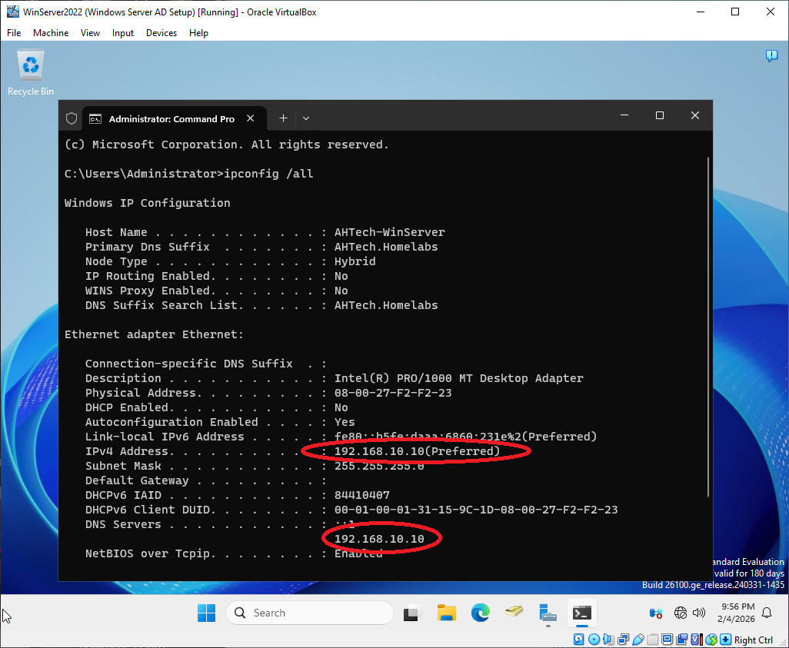
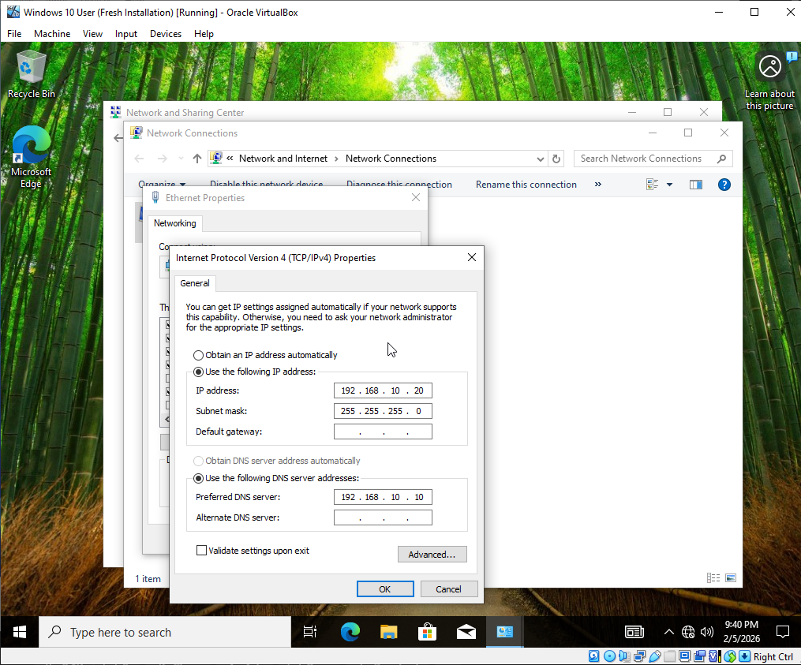
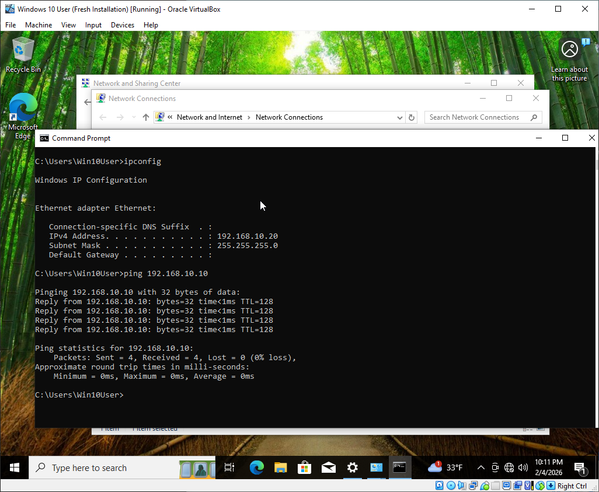
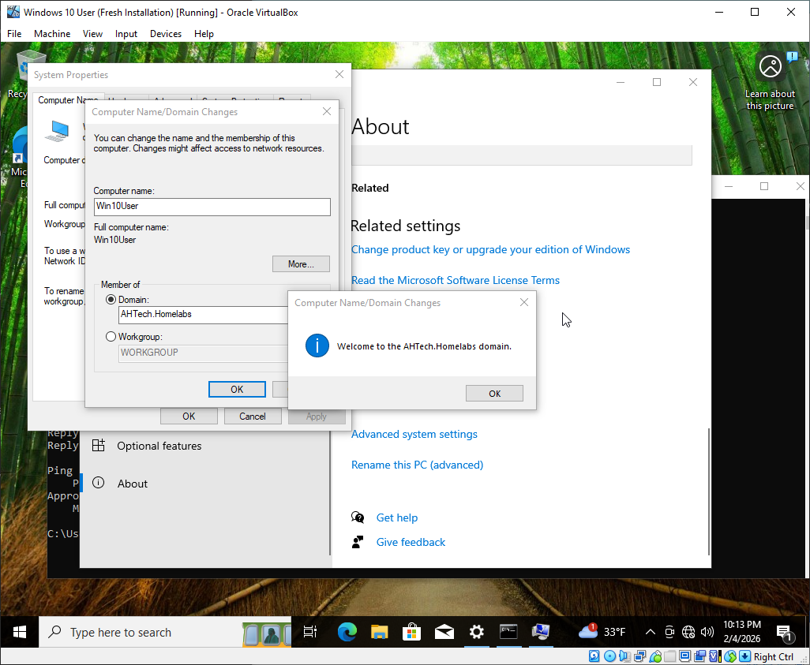
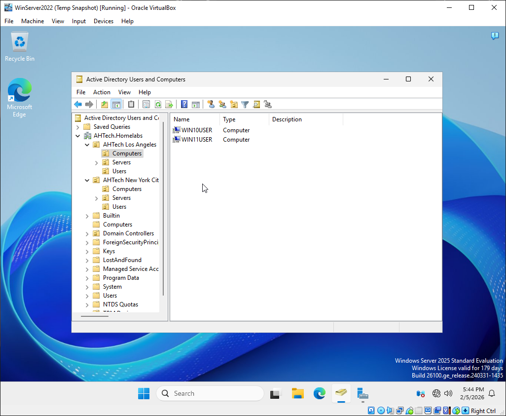

# Active Directory Implementation & Endpoint Provisioning

## Objective

Connect Windows 10 and Windows 11 Computers to the Domain Controller.

### Configuring IPs and DNS on Windows Server 2022

Assign a Static IP and Subnet Mask to the Windows Server 2022 instance hosting the Domain Controller. 
Set the Preferred DNS to either the server's static IP or the loopback address `127.0.0.1` to ensure proper service resolution.

Verify Network Configuration: Run `ipconfig /all` in the Command Prompt to confirm that the static IP, Subnet Mask, 
and Preferred DNS settings match your Domain Controller's configuration.

 
### Active Directory Client Integration: Windows 10 & 11

The process for joining a domain is consistent across Windows 10 and Windows 11. 
For the purposes of this guide, all examples and screenshots utilize a Windows 10 Pro environment.

Set the Preferred DNS to Server's Static IP Address
>**Note**: In a production environment, workstations typically receive DNS settings automatically via DHCP. 
A static configuration is used here because the lab environment currently lacks a dedicated DHCP server.

Connectivity Check: Open Command Prompt and verify the connection to the Domain Controller using the `ping` command: `ping 192.168.10.10`

After verification, go to System Properties `Settings > System > About > Advanced > Rename this Computer`.
Through `System Properties` under `Computer Name` click `Change` and change Member of Workgroup to Domain.
Enter the Domain name (`AHTech.Homelabs`) and type in credentials to connect to the Domain.

Verify on the Active Directory that the computer has successfully connected.

