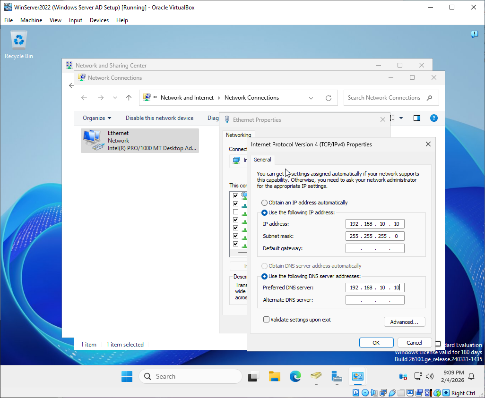
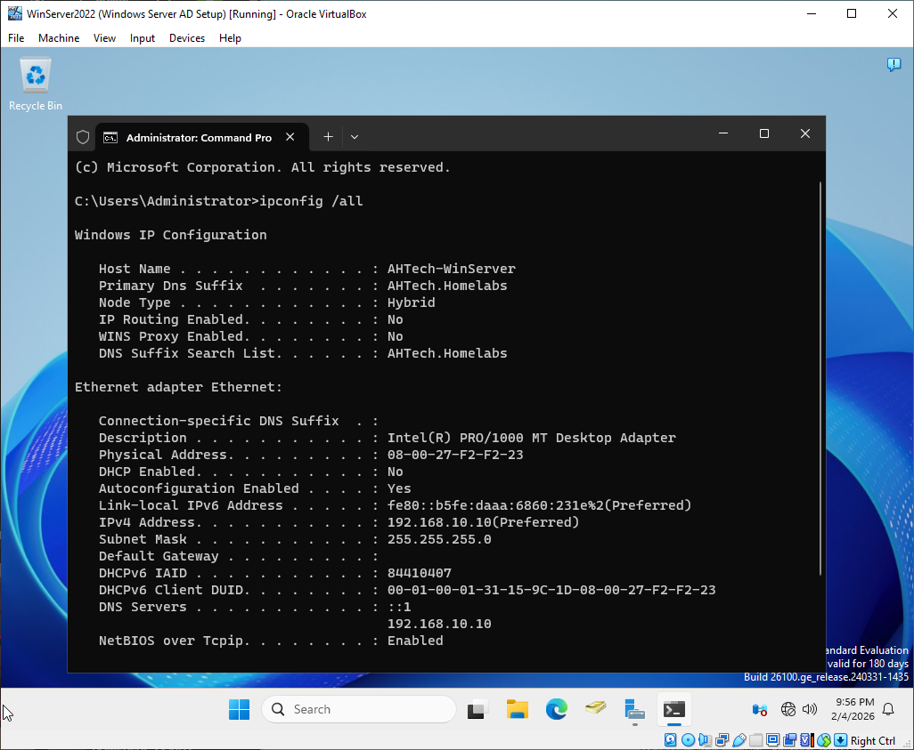

# Active Directory Implementation & Endpoint Provisioning

## Objective

Connect Windows 10 and Windows 11 Computers to the Domain Controller.

## Configuring IPs and DNS on Windows Server 2022

Assign a Static IP and Subnet Mask to the Windows Server 2022 instance hosting the Domain Controller. 
Set the Preferred DNS to either the server's static IP or the loopback address '127.0.0.1' to ensure proper service resolution.

Verify Network Configuration: Run 'ipconfig /all' in the Command Prompt to confirm that the static IP, Subnet Mask, 
and Preferred DNS settings match your Domain Controller's configuration.

 
## Configuring IPs and DNS on Windows 10 Computer

