# Creating Group Policies

### Objective

Create a GPO for each of the following:

+ Password Length and Expiration

+ Specify a Desktop Wallpaper for all Users

+ Control Panel Access Restrictions

+ Deny Removable Drive from being Accessed

+ Account Lockout Policy 

## Understanding Group Policies and How to Create One

### Understanding Group Policies

Group Policies are divided into two main types of configurations: "Computer Configurations" and "User Configurations." Each of these categories includes both "Policies" and "Preferences," which contain predefined settings that can be applied throughout the domain.

**Computer Configurations**
Settings and Policies pertaining to the computer regardless of the user who logs in. They control aspects such as software installation, security settings, and Operating System functionalities.

**User Configurations**
Settings targetting user accounts and their environments. These settings apply when a user logs into any computer within a domain, allowing for personalized environments, such as desktop settings, application configurations, and user permissions.

**Policies**
Mandatory settings that cannot be overidden by users and takes effect immediately upon application.

**Preferences**
Optional settings that users can modify and change as needed.

### How to Create Group Policies

To create a group policy, open Group Policy Management, or `gpmc.msc` on command line interface. 

Righ-click the Domain that you want the GPO to apply to and select "Create a GPO in this domain, and Link it here..."

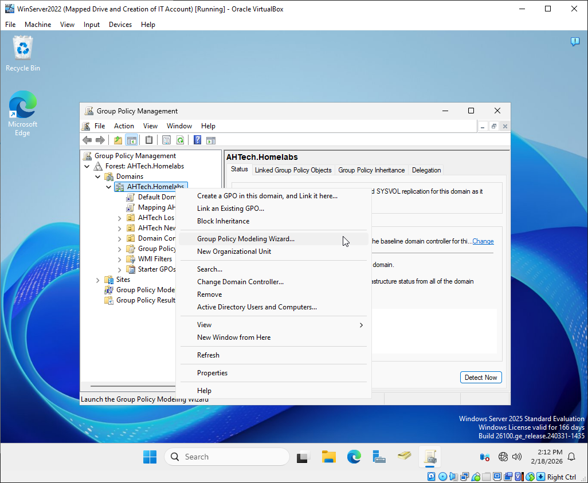

Name the GPO. For organization, it's best to name it after its function.

Once the GPO has been created, edit the GPO and set the settings for the Group Policy.

## Group Policy Objective
### Password Length and Expiration GPO

Password Policy can be set under: `Computer Configurations` > `Policies` > `Windows Settings` > `Security Settings` > `Account Policies`

Managing end user's password is important to prevent log in vulnerablility.

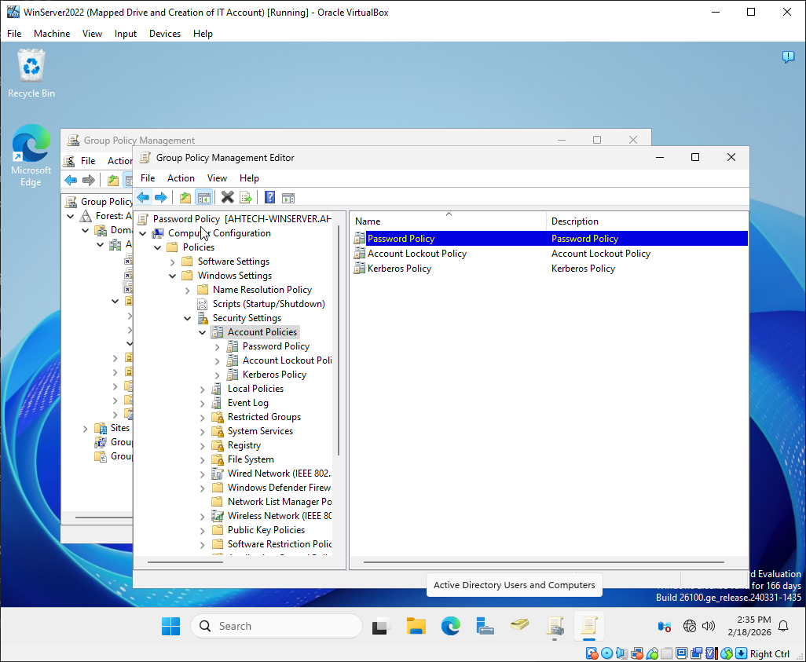

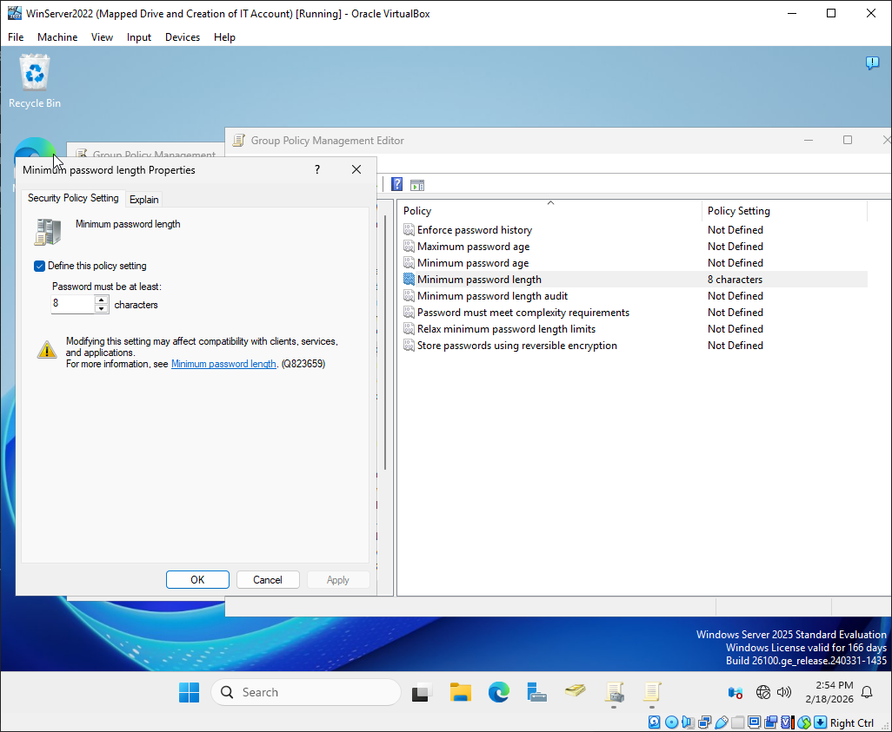

### Specify a Desktop Wallpaper for all Users

Desktop Wallpaper Group Policy Settings can be found under: `User Configurations` > `Policies` > `Administrative Template` > `Desktop` > `Desktop` > `Desktop Wallpaper`

Having a Desktop Wallpaper Policy will create a uniformed and professional look for the organization.

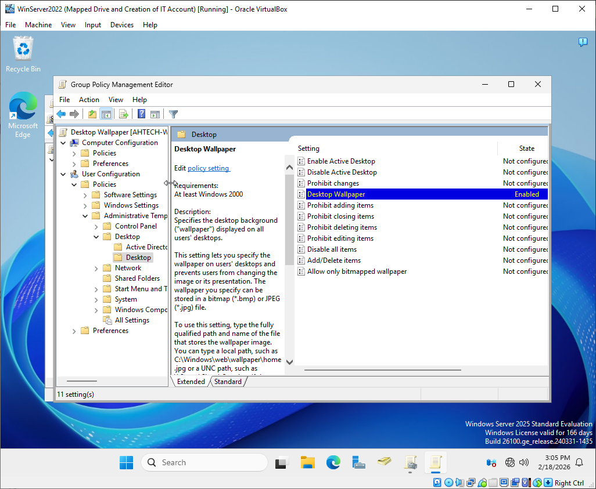

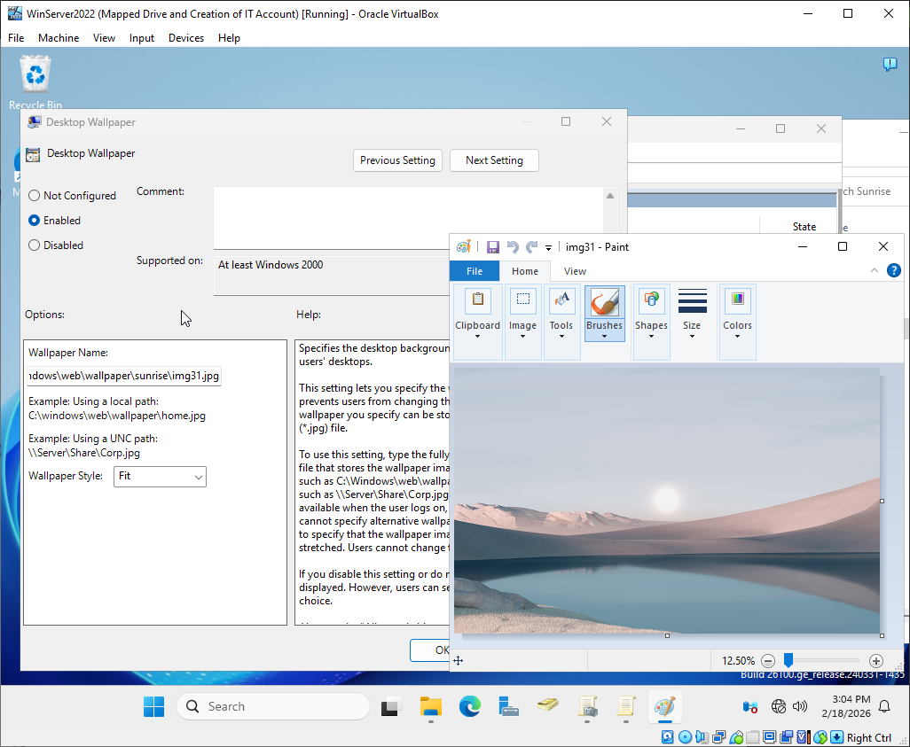

### Control Panel Access Restrictions

To restrict access to the control panel, the GPO settings can be found under: `User Configurations` > `Policies` > `Administrative Template` > `Control Panel` 

Restricting the Control Panel will prevent misconfigurations from end users.

When an end user tries to access the control panel, they will recieve a "restriction" dialog box.

### Deny Removable Drive from being Accessed

To deny removeable drive from being accessed, the GPO setting is found under: `Computer Configuration` > `Policies` > `Administrative Templates` > `System` > `Removable Storage Access`

Denying removable drives help protect systems from being compromised by external devices.

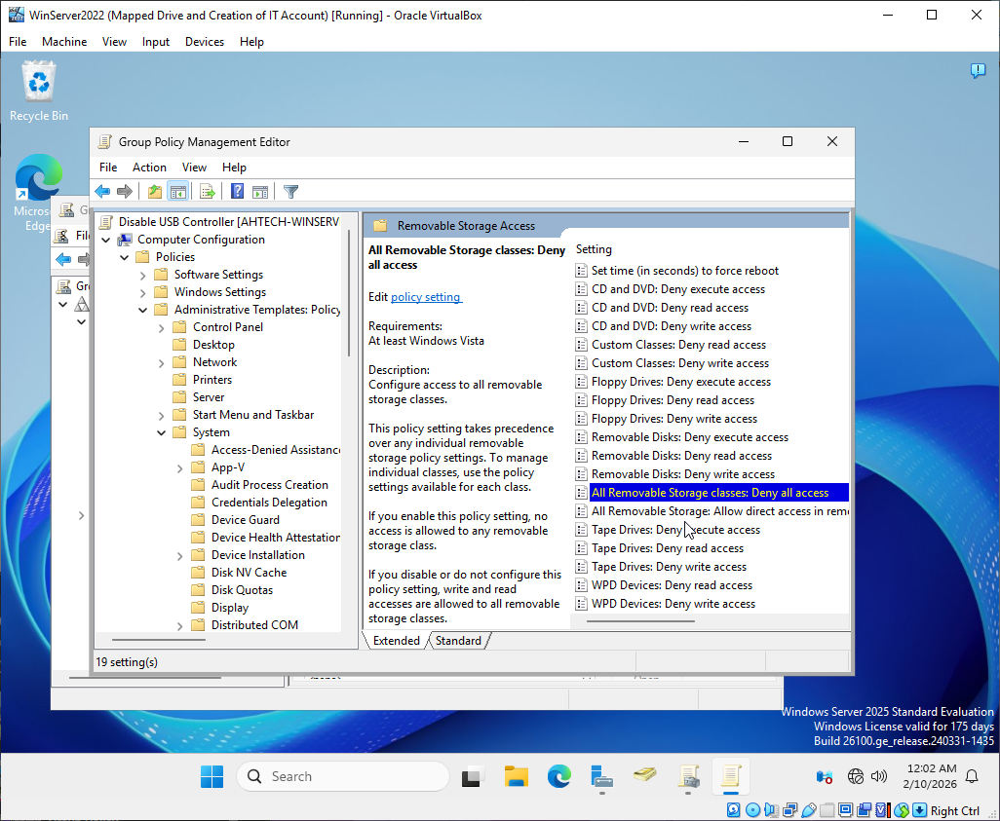

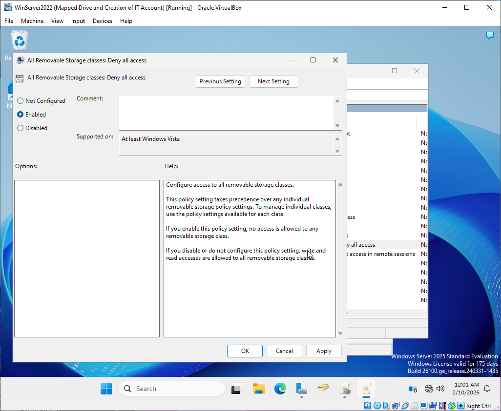

### Account Lockout Policy

Account Lockout GPO setting is found in the same directory as Password Policies: `Computer Configurations` > `Policies` > `Windows Settings` > `Security Settings` > `Account Policies`

Account Lockout helps prevent brute force attacks by limiting the amount of password a user can enter before being timed or locked out.

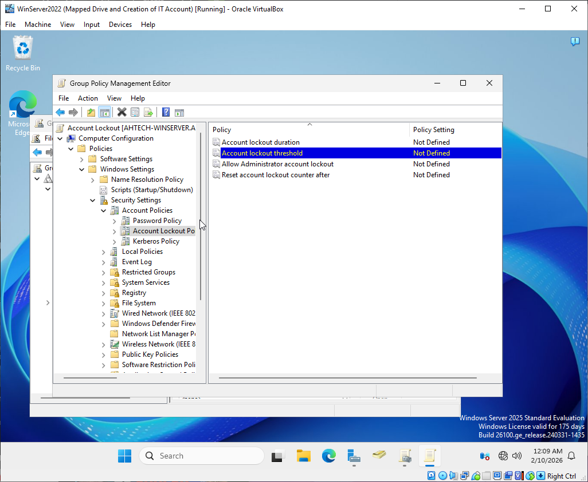

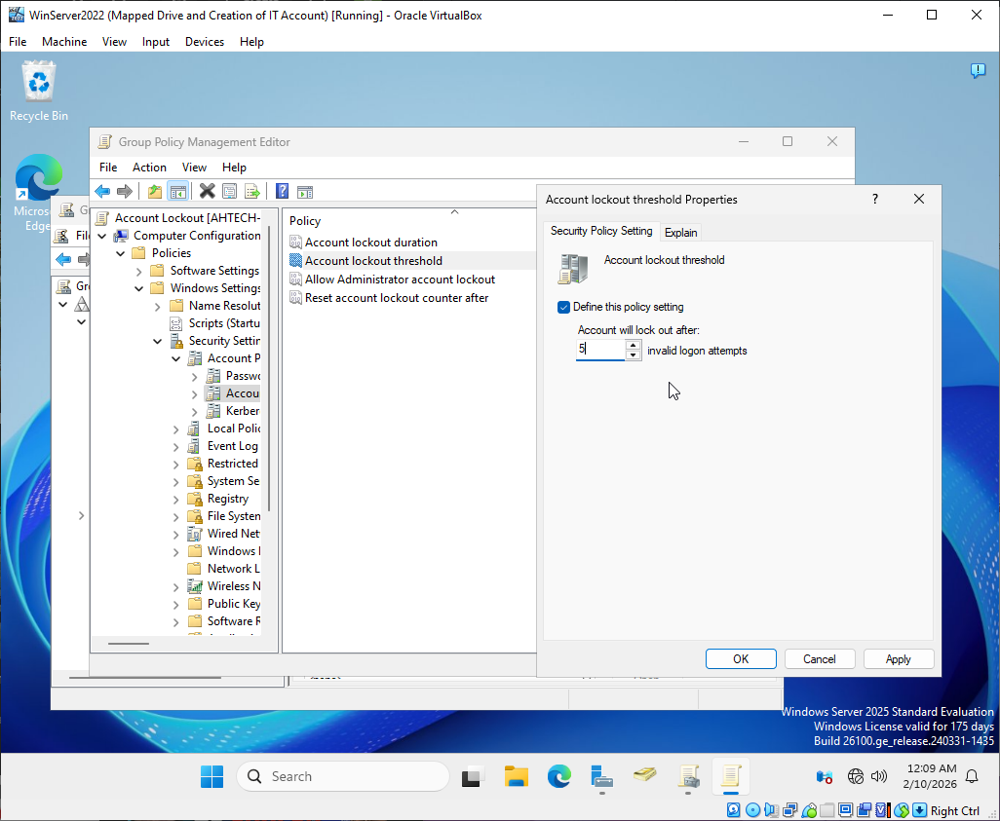

## Extra Notes about Group Policies

### Security Filtering

Security Filtering is a great way to assign GPO to certain Users or Groups. Usually when a GPO is made, it is active throughout the whole domain it was created under. Security Filtering gives administrators the tool to be specific in which policy effects who or whom. 

Security Filtering can be found by selecting the GPO and and scroll down on the right panel to "add" or "remove" Users and Groups.

In the following example, the user "Chris Chen" and "Finance" security group was added to the GPO, Account Lockout's Security Filter.

### Linking and Deleting Group Policies

You can unlink and remove a group policy from being active in the Group Policy Managment console. When you delete the group policy it remains in the Group Policy Object container. The GPO can be relinked again by right-clicking on the domain and selecting "Link an Existing GPO..."  

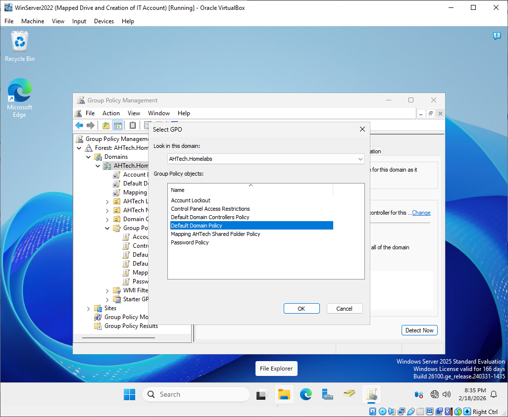

To fully delete a GPO, it must be deleted in the Group Policy Object Container.

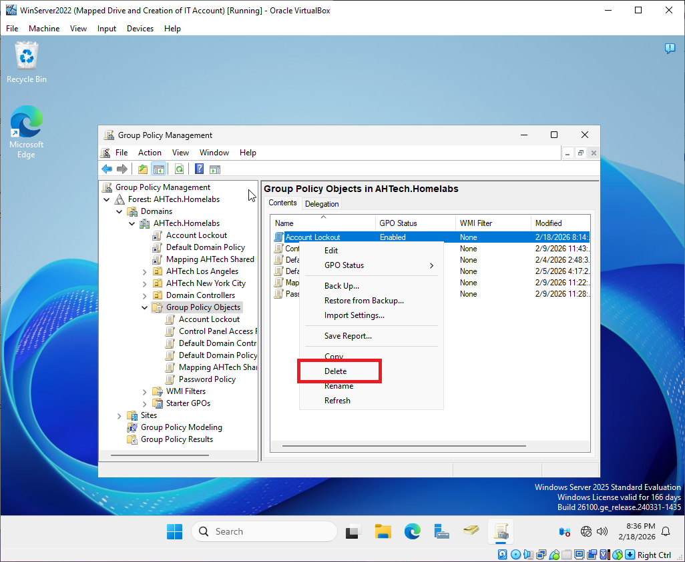

