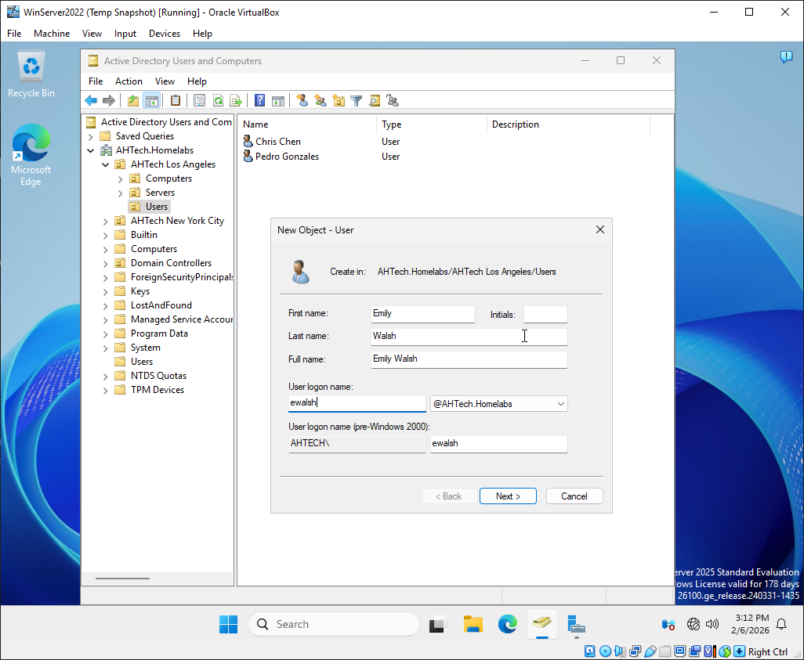
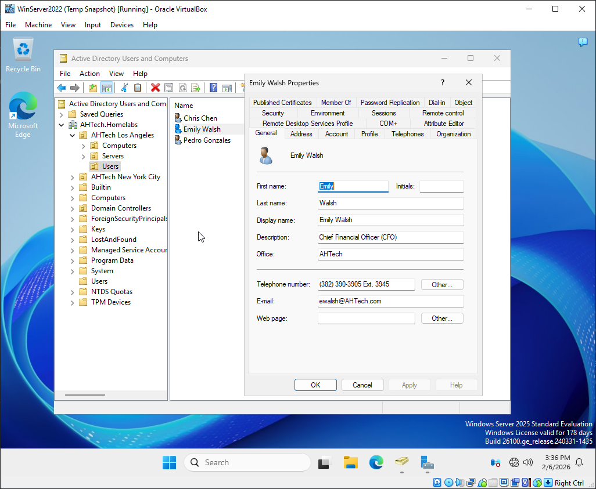
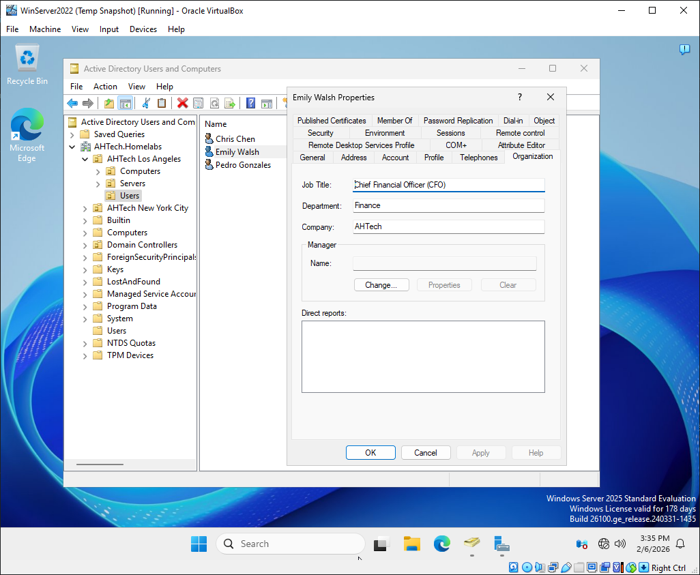

# Onboarding New Users

## Objectives

1) Create the specified users in our branch in Los Angeles. Then create and assign them to their corresponding department security groups to ensure proper NTFS permission inheritance.

|Names		|Department	|Title				|Company Number		 |Email			|Special Notes							|
|---------------|---------------|-------------------------------|------------------------|----------------------|-------------------------------------------------------|
|Emily Walsh	|Finance	|Chief Financial Officer (CFO)	|(382) 390-3905 Ext. 3945|`ewalsh@AHTech.com`	|Give special modify permission to the Finance Folder	|
|Chris Chen	|HR		|Talent Acquisition Specialist	|(382) 390-3905 Ext. 2034|`cchen@AHTech.com`	|							|
|Pedro Gonzales	|Marketing	|Product Marketing Manager (PMM)|(382) 390-3905 Ext. 4902|`pgonzales@AHTech.com`|							|

2) **Create a Shared Home Folder**
 
- Create a network drive to each user's account called "AHTech Shared Folder" that is accessible by all Users.
- Within it, create a folder for each department that can be accessed by only the members of their department. Each New User should have their own home folder with modify permissions in their respective department. 
- Then log into each user's account and create a text file with their name to verify access.

3) Map "AHTech Shared Folder" to a drive on New User's account for easy access.

## Onboarding Process

### Creating New Users

In the Los Angeles/Users OU, create the New User and their credentials. Then create a password and tick the necessary options for the new account. 
>**Note**: "Emily Walsh" and a Windows 11 Client will be used as an example throughout the process. This will be the same for the other New Users and on Windows 10 Client. 

In the same `Properties` dialog box under the `General` and `Organization` Tab, add in other information and descriptions for each end user.

### Creating Security Groups

