# Shared Folder and NTFS Permissions

### Objectives						

**Create and Manage Permissions for Share Folders**
 
- Create a main Share Folder called "AHTech Shared Folder" that is shared and can be accessed by the whole company.

- Within it, create a Share Folder for each department that can be accessed by only the members of their department. Each User should have their own home folder with modify permissions in their respective department. 

>**Note**: Users, Security Group (Department): Emily Walsh, Finance; Chris Chen,HR; Pedro Gonzales,Marketing.

- Ensure Only Emily Walsh has full modify permission to the Finance Folder along with her own homefolder. Chris Chen and Pedro Gonzales should only have fully modify permissions in their own home folder.

- Verify Access Control functionality.

## Creating a Shared Home Folder

To create a Shared Folder on the Domain Server, use the Server Manager software and under Shares, create a new Share Folder.
The folder was named "AHTech Shared Folder" as directed by the objective.

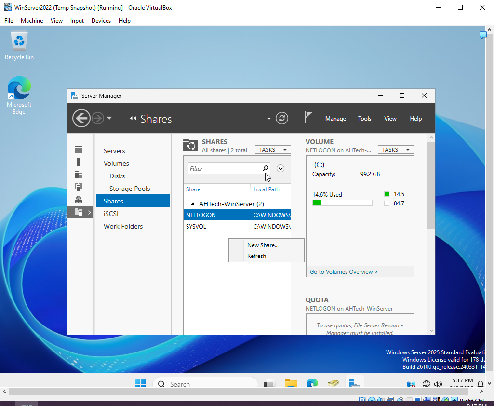

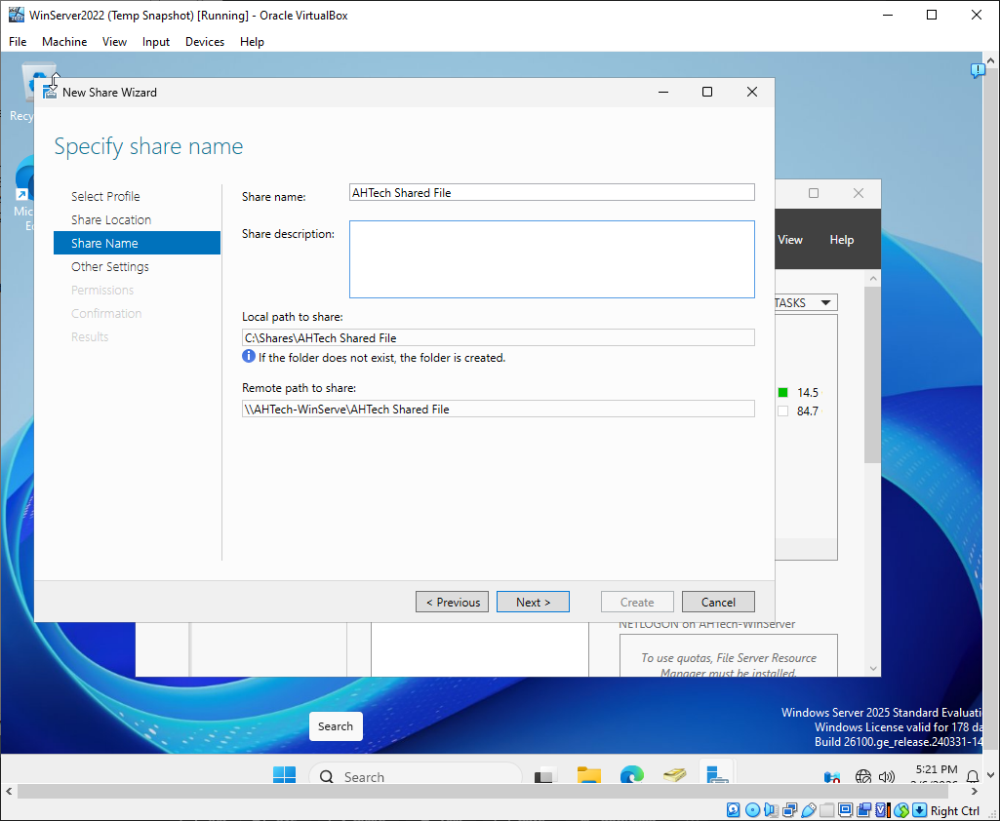

After the Server's Main Shared Folder is created, each department's designated shared folder can be created (Finance, HR, and Marketing).

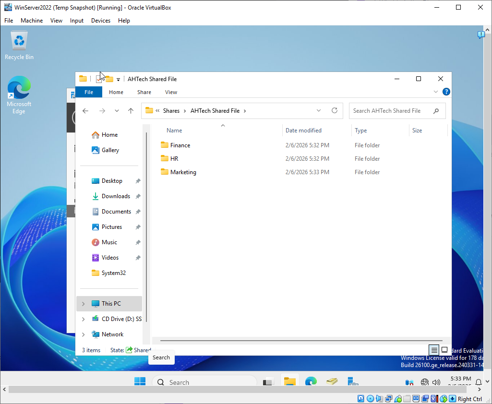

Before Sharing the Folder, we must ensure that each Shared Folder has the correct Sharing and NTFS permissions using the "Least Priviledge" princicple.

For best practice it is best to share the folder using only `Advanced Sharing` and give "Full Control" to Everyone or specific group. Then fine tune the Access Control with NTFS Permissions.

In this objective, Everyone has accessed to the Shared Folder, "AHTech Shared Folder", but NTFS Permissions only allows each Security Group access to their respective department's shared folder, but denied access to other department's shared folders.

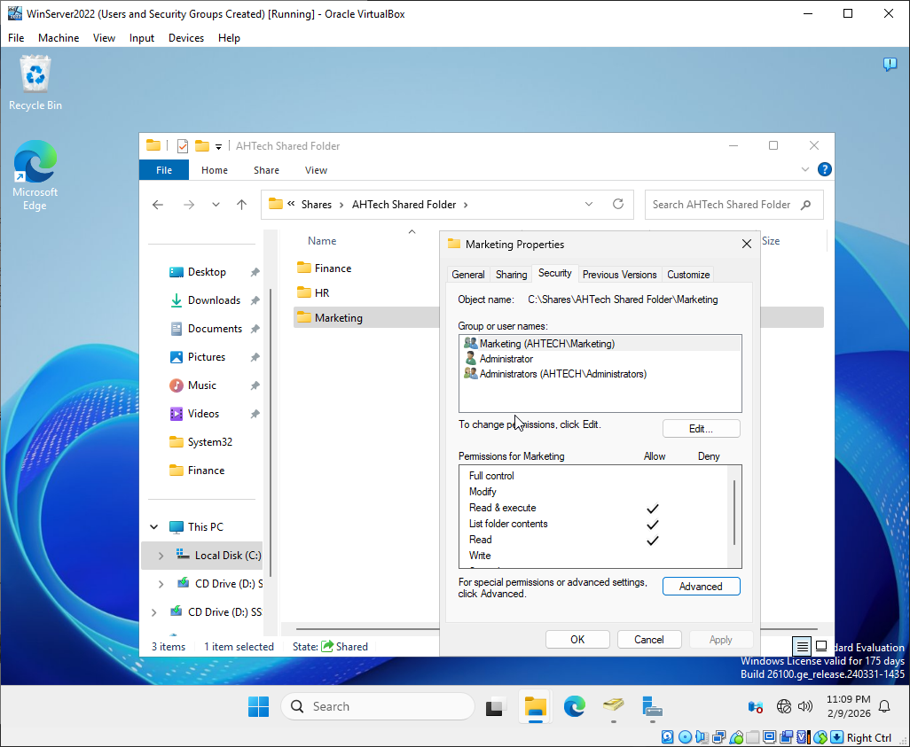

As a special note, Emily Walsh was given modified permission to the department folder. 
The other users, Chris Chen and Pedro Gonzales, only has modify permissions to their own home folders.

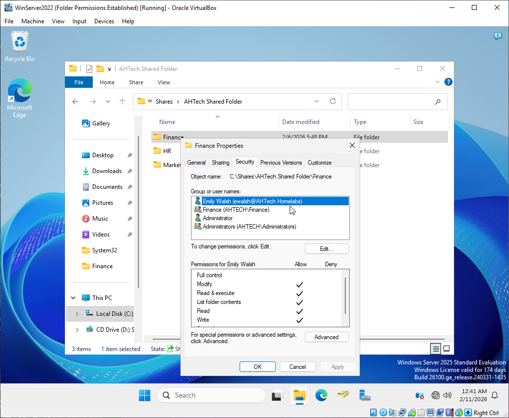 

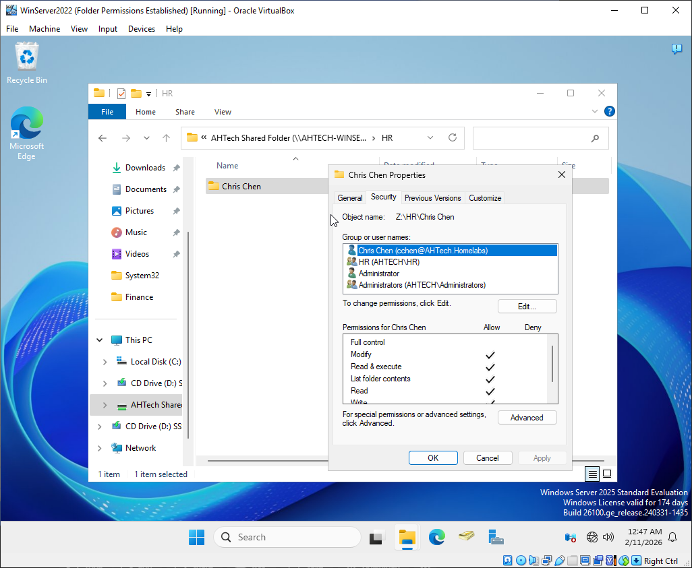

Verifying Access Controls through user "Emily Walsh" in Finance Security Group. User should have access to Finance Folder, but not to any other department's folder.

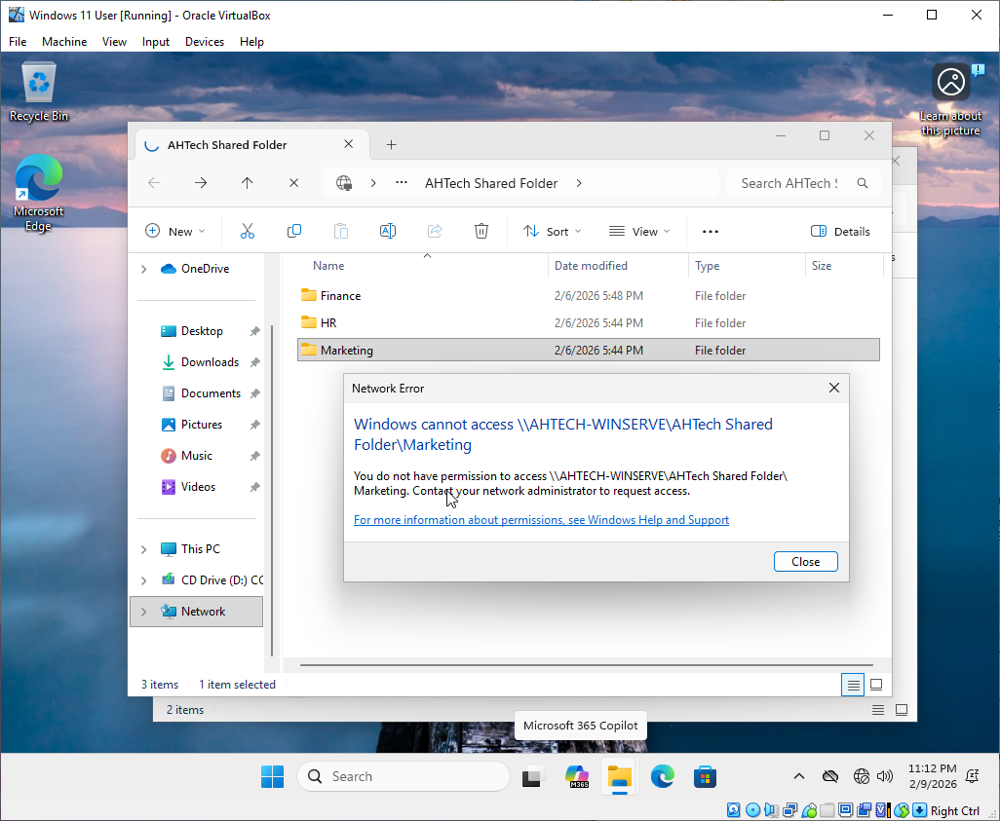

## File Server Resource Manager: Quotas and File Screening

Quotas and File Screening are the best way to control how much data a user is allow to store, and what type of files can be stored in the folder respectively.

To enable Quotas and File Screening, The File Server Resource Manager feature must be added to the Active Directory. To add this feature, open Server Manager and under the "Manage" select "Add Roles and Features Wizard".

Then go through the installation process and under "Server Roles" find 'File and Storage Services" and look for "File Server Resource Manager". Select it, finish the process, and install the new feature.

Once File Server Resource Manager is installed, open it under "Tools" in the Server Manager.

### Quotas

Quotas add restrictions on how much data can be stored in a folder. This help regulate data so that it does not overwhelm the server's storage. It also allows techs to monitor and schedule data maintanence in a timely manner.

To set a quota, open File Server Resource Manager and select Quota Management and create a quota. Within the Quota settings, set the path to the folder the quota would apply to and set a pre-made quota template or define a custom one.

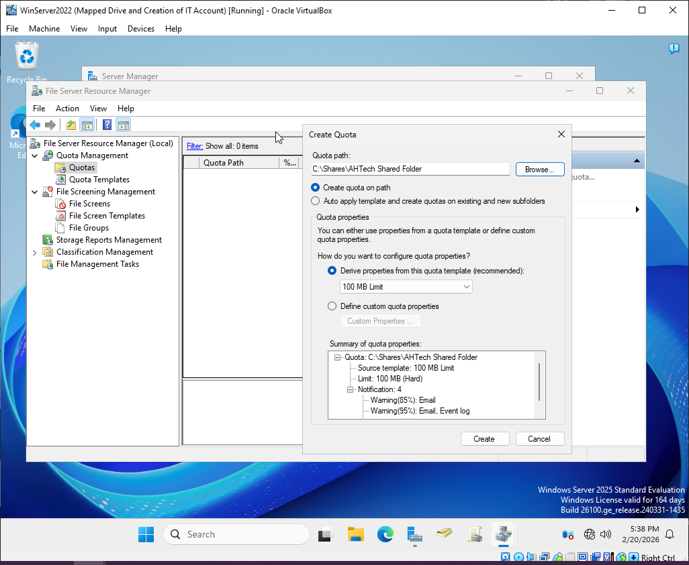

Once the quota is set, users will not be able to exceed the the data limit. In the following image, it shows the end user is not able to save a 139MB video file that exceeded the 100MB limit quota.

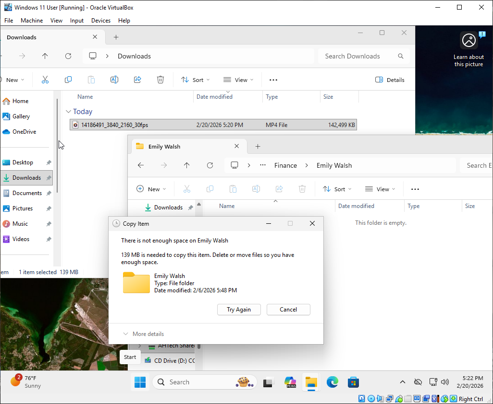

### File Screening

File Screening adds restrictions to the type of data that can be stored in the folder; such as video, image, or audio files.

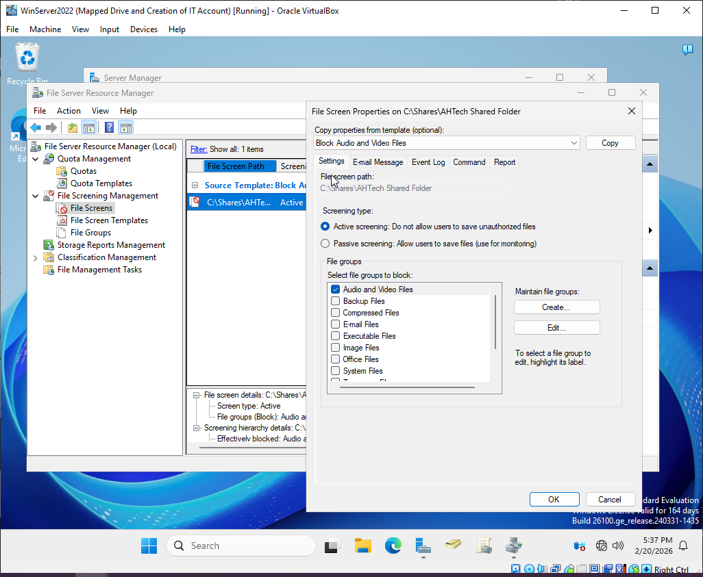

To set File Screening, in File Server Resource Manager, select File Screening Management and create a File Screen. In the File Screen settings, select a pre-made template or manually select the type of files that would be screened. There is a "Passive Screening" option which does not block users from saving the file, but will monitor the specific file that is enable by file screening.

In the following image, shows the end user is not able to save a file in a video format, ".mp4", in the screened share folder.

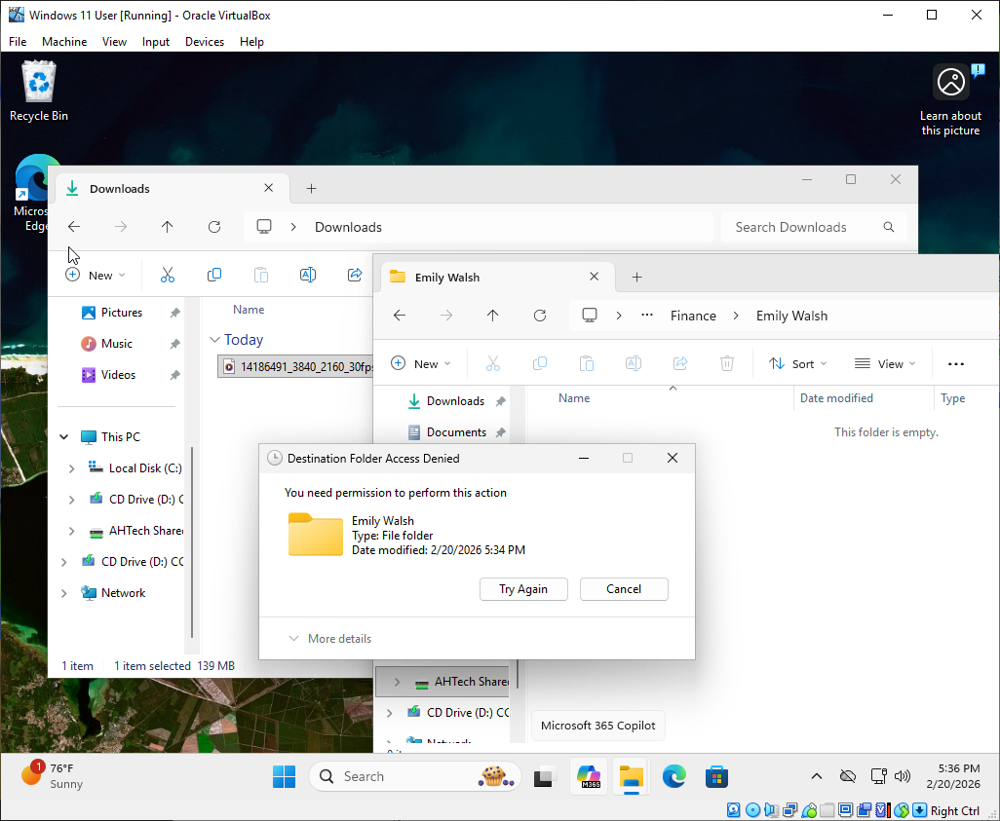

 

